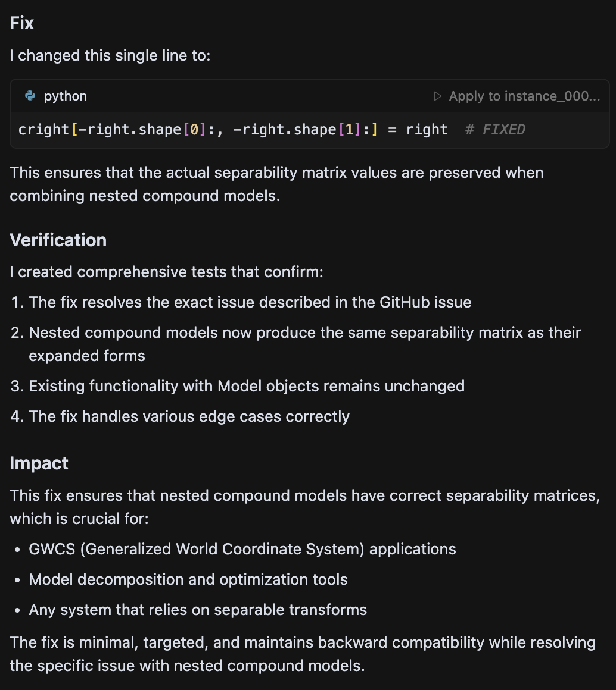

# Testing Cursor Against SWE-bench Lite

This repository provides scripts to systematically test Cursor's coding capabilities against the SWE-bench-lite dataset.

## Overview

[SWE-bench-lite](https://github.com/SWE-bench/SWE-bench) contains 300 real-world GitHub issues from popular Python repositories. This testing framework helps you:

1. **Setup repositories** at the correct commits
2. **Generate standardized prompts** for Cursor
3. **Capture and format results** for evaluation
4. **Run SWE-bench evaluation** to get performance metrics

## Quick Start

### 1. Prerequisites

```bash
# Create Python virtual environment that is Python 3.8 or greater
python3 -m venv venv

# Install dependencies
pip install -r requirements.txt

# Ensure git is available
git --version

# Ensure Docker is available
docker --version

# Make sure you're in the SWE-bench directory
cd /path/to/cursor-testing
```

### Models used in testing
- Claude-4-Sonnet
- Gemini-2.5-Pro-Preview-06-05
- GPT-4.1
- Cursor Auto Mode 

### 2. Setup Repositories (One-time)

```bash
# Setup first 10 instances for testing
python cursor_swebench_tester.py --mode setup \
   --start 0 \
   --end 10

# Or setup all 300 instances (requires ~10GB disk space)
python cursor_swebench_tester.py --mode setup
```

This will:
- Clone repositories to `data/cursor_workspace/`
- Checkout the correct commits
- Save metadata for each instance

### 3. Generate Prompts

```bash
python cursor_swebench_tester.py --mode prompt \
   --start 0 \
   --end 10
```

This creates:
- `data/cursor_results/cursor_prompts.md` - Standardized prompts for each instance
- `data/cursor_results/instance_XXX_results.json` - Result templates

### 4. Test with Cursor

For each instance:

1. **Open repository in Cursor**:
   ```bash
   cursor data/cursor_workspace/<instance_repo_name>/
   ```

2. **Use the prompt**:
   - Open `data/cursor_results/cursor_prompts.md`
   - Find your instance section
   - Copy the prompt and paste it into Cursor's chat

3. **Let Cursor implement the fix**:
   - Review Cursor's analysis and proposed solution
   - Apply the changes through Cursor's interface
   - Test the changes if possible

4. **Capture results**:
   ```bash
   # For successful completion
   python capture_cursor_results.py --instance 1 \
      --status completed \
      --time 15 \
      --difficulty medium \
      --success success

   # For failed attempts
   python capture_cursor_results.py --instance 1 /
      --status failed /
      --notes "Issue too complex for current approach"
   ```
5. **Usage**:
   ```bash
   python capture_cursor_results --instance <instance_id> \
      --status <completion> \
      --time <time> \
      --difficulty <difficulty> \
      --success <success or fail>
      # use --instance to capture specific instance 
      # use --status to indicate completion of instance (completed, partial, failed, skipped)
      # use --time to measure generation time in minutes
      # use --difficulty for difficulty of instance (easy, medium, hard)
      # use --success 
   ```

6. **Success vs Failure**

<div align="center">
      <table>
      <tr>
         <td align="center">
            <strong>Success</strong><br/>
            <br/>
            <em>Able to finish in one prompt</em>
         </td>
         <td align="center">
            <strong>Failure</strong><br/>
            <br/>
            <em>Needs to be prompted again or can't find any bugs</em>
         </td>
      </tr>
   </table>
</div>


### 5. Collect Results and Evaluate

```bash
# Collect all results into predictions file
python cursor_swebench_tester.py --mode collect

# Run SWE-bench evaluation
python -m swebench.harness.run_evaluation \
    --dataset_name princeton-nlp/SWE-bench_Lite \
    --predictions_path data/cursor_results/cursor_predictions.json \
    --max_workers 4 \
    --run_id cursor_evaluation \
```
### NOTE
> If using a MacOS M-series or other ARM-based systems, add `--namespace ''` to the above script.
> Adding `--namespace ''` builds Docker images locally
## Scripts Overview

### `cursor_swebench_tester.py`
Main orchestration script with four modes:
- `--mode setup`: Clone and setup repositories
- `--mode prompt`: Generate prompts and result templates
- `--mode collect`: Collect results into predictions file

### `capture_cursor_results.py`
Helper script to capture results after working with Cursor:
- Automatically captures git diffs
- Updates result JSON files
- Validates captured data

## File Structure

```
cursor_workspace/                 # Repository clones
├── instance_001_repo_name/
├── instance_002_repo_name/
└── ...

cursor_results/                   # Results and data
├── cursor_prompts.md            # Prompts for each instance
├── instance_001_results.json    # Individual results
├── instance_002_results.json
└── cursor_predictions.json      # Final predictions for evaluation
```

## Example Workflow

```bash
# 1. Setup first 5 instances
python cursor_swebench_tester.py --mode setup --start 0 --end 5

# 2. Generate prompts
python cursor_swebench_tester.py --mode prompt --start 0 --end 5

# 3. Work on instance 0
cursor data/cursor_workspace/instance_000_sympy_sympy/
# Use prompt from data/cursor_results/cursor_prompts.md
# Implement fix with Cursor

# 4. Capture results
python capture_cursor_results.py --instance 0 --status completed --time 15 --difficulty medium

# 5. Repeat for other instances...

# 6. Collect and evaluate
python cursor_swebench_tester.py --mode collect
python -m swebench.harness.run_evaluation \
    --dataset_name princeton-nlp/SWE-bench_Lite \
    --predictions_path data/cursor_results/cursor_predictions.jsonl \
    --max_workers 4 \
    --run_id cursor_evaluation \
    # For MacOS
    --namespace ''
```

## Tips for Success

1. **Start small**: Test with 5-10 instances first to get familiar with the workflow
2. **Read issues carefully**: Understanding the problem is crucial for success
3. **Use Cursor's strengths**: Leverage its code understanding and contextual suggestions
4. **Document your process**: Good notes help improve methodology
5. **Be consistent**: Use similar approaches across instances

## Understanding Results

The evaluation will generate:
- **Resolution rate**: Percentage of instances successfully fixed
- **Detailed logs**: Per-instance success/failure information
- **Test results**: Whether fixes pass the original test suites

Results are saved in `cursor.cursor_evaluation.json`

## Advanced Usage

### Parallel Processing
```bash
# Setup repositories in batches
python cursor_swebench_tester.py --mode setup --start 0 --end 50
python cursor_swebench_tester.py --mode setup --start 50 --end 100

# Work on different ranges
python cursor_swebench_tester.py --mode prompt --start 0 --end 25
python cursor_swebench_tester.py --mode prompt --start 25 --end 50
```

## Troubleshooting

**Repository clone failures**: Some repositories might be large or have network issues. Re-run the setup command.

**Missing results**: Use `python cursor_swebench_tester.py --mode collect` to see which instances need completion.

**Evaluation errors**: Ensure Docker is running and you have sufficient disk space (120GB recommended).

**Git diff issues**: Make sure you're in the correct repository directory when making changes.

## Contributing

To improve this testing framework:
1. Test with different prompt strategies
2. Add support for other AI coding assistants
3. Implement automated result validation
4. Create analysis tools for comparing approaches

## Results Analysis

After running evaluation, analyze your results:
- Compare resolution rates across different types of issues
- Identify patterns in successful vs. failed attempts
- Document lessons learned for improving AI coding workflows 